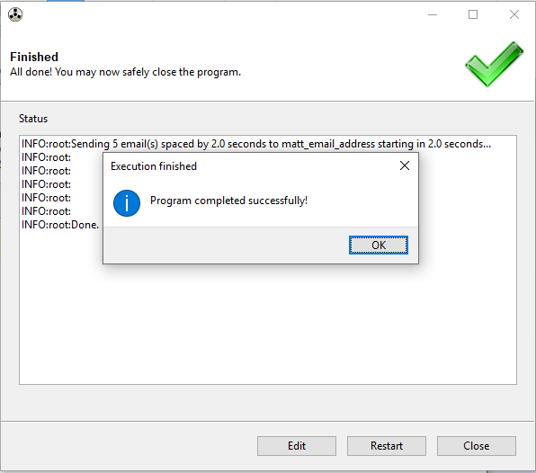

An example of using [`Gooey`](https://github.com/chriskiehl/Gooey) to generate a simple GUI frontend that requires only two additional lines of code.  You can find more examples here:

https://github.com/chriskiehl/GooeyExamples

# Installing
Follow instructions on the Gooey GitHub page.

```
pip install Gooey
``` 

NOTE: you will need X11 to run the GUI, which means that using Cygwin or WSL will not work.


## Version
```
>>> gooey.__version__
'1.0.2'
```

# Running

## Command Line Version

You can see how the command line version would be run if you comment out the `@Gooey` decorator on `main`.

```
python3 ./example_simple.py --name Matt --message "Your code is awesome!" --num-emails 5 --delay 2.0 --spacing 2.0
```

## Simple Example
`python3 example_simple.py`




## GooeyParser Example
`python3 example_gooey_parser.py`


